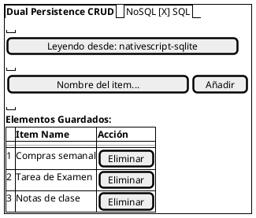

# Examen Práctico - Persistencia Dual en Móviles (NativeScript)

## Descripción
Este proyecto implementa una arquitectura de **Persistencia Dual**, permitiendo que una aplicación móvil CRUD básica alterne en tiempo de ejecución entre un motor de datos relacional (SQL) y uno no relacional (NoSQL). La principal ventaja de este diseño es el **desacoplamiento total de la interfaz de usuario**, la cual no requiere reiniciarse ni conoce la implementación técnica del almacenamiento subyacente, garantizando una experiencia de usuario fluida y una lógica de negocio altamente mantenible.

## Stack Tecnológico Seleccionado
*   **Framework:** NativeScript con TypeScript (Arquitectura nativa sin WebView).
*   **Motor SQL (Relacional):** `nativescript-sqlite`, permitiendo un esquema estructurado y consultas mediante SQL estándar.
*   **Motor NoSQL (Documental/Archivo):** Implementación basada en sistema de archivos (JSON), simulando una base de datos documental flexible y sin esquema estricto.
*   **Gestión de Estado y Reactividad:** Uso de la clase `Observable` y `ObservableArray` de NativeScript. Esto asegura que cualquier cambio en los datos o en el motor de persistencia se refleje instantáneamente en la UI mediante el patrón de *Data Binding*.

## Mecanismo de Conmutación y Patrón Repositorio
La arquitectura se fundamenta en el **Patrón Repositorio** mediante la interfaz `IRepository`. Esta capa de abstracción define un contrato común para las operaciones CRUD, permitiendo que el `ViewModel` interactúe con los datos de forma agnóstica a la tecnología.

*   **Independencia de Implementación:** El guardado y la recuperación de datos son procesos independientes de la visualización. Al conmutar el `Switch` en la UI, el sistema simplemente intercambia la instancia del repositorio activo.
*   **Justificación Técnica:** Esta separación de responsabilidades permite que la lógica de persistencia evolucione (por ejemplo, migrar de JSON a MongoDB o de SQLite a Room) sin alterar una sola línea de código en la capa de presentación.

## Diseño y Arquitectura (PlantUML)

```plantuml
@startuml
package "Capa de Presentación (UI)" {
    [main-page.xml] as View
    [main-page.css] as Styles
}

package "Capa de Estado y Reactividad" {
    [MainViewModel] as VM
}

package "Capa de Lógica (Business Logic)" {
    interface IRepository {
        +init()
        +getAll()
        +create()
        +delete()
    }
}

package "Capa de Persistencia" {
    [SqliteRepository] as SQL
    [NoSqlRepository] as NoSQL
    database "SQLite DB" as DB1
    file "data.json" as DB2
}

View <--> VM : Data Binding
VM --> IRepository : Utiliza
IRepository <|.. SQL
IRepository <|.. NoSQL
SQL --> DB1
NoSQL --> DB2
@endum
```

## Mockup / Wireframe de la UI (PlantUML Salt)



## Auditoría y Logs
Se ha implementado una clase `Logger` personalizada que garantiza la trazabilidad de cada operación en el sistema. Los logs están clasificados jerárquicamente:
*   **INFO:** Cambios de estado global, como la inicialización de motores o la conmutación entre SQL y NoSQL.
*   **DEBUG:** Detalles de transacciones individuales (ej. "SQL Insert: Item X").
*   **ERROR:** Captura de excepciones en el sistema de archivos o fallos en las consultas a la base de datos.
El formato incluye una marca de tiempo ISO para auditoría técnica en tiempo real.

## Instrucciones de Ejecución

### Requisitos Previos
*   NativeScript CLI instalado (`npm install -g nativescript`).
*   Entorno de Android configurado (Android SDK y Emulador).

### Pruebas Unitarias
Para validar la lógica de los repositorios y el mecanismo de cambio de motor:
```bash
ns test android --just-one
```

### Ejecución de la Aplicación
Para compilar e instalar la aplicación en el emulador o dispositivo físico:
```bash
# Instalar dependencias (Desde la raíz C:\Moviles\Examen2)
npm install

# Ejecutar en Android
ns run android
```
